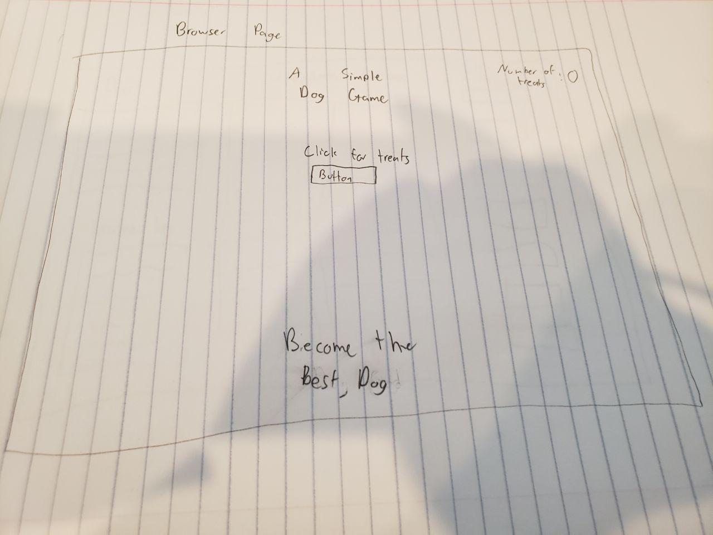
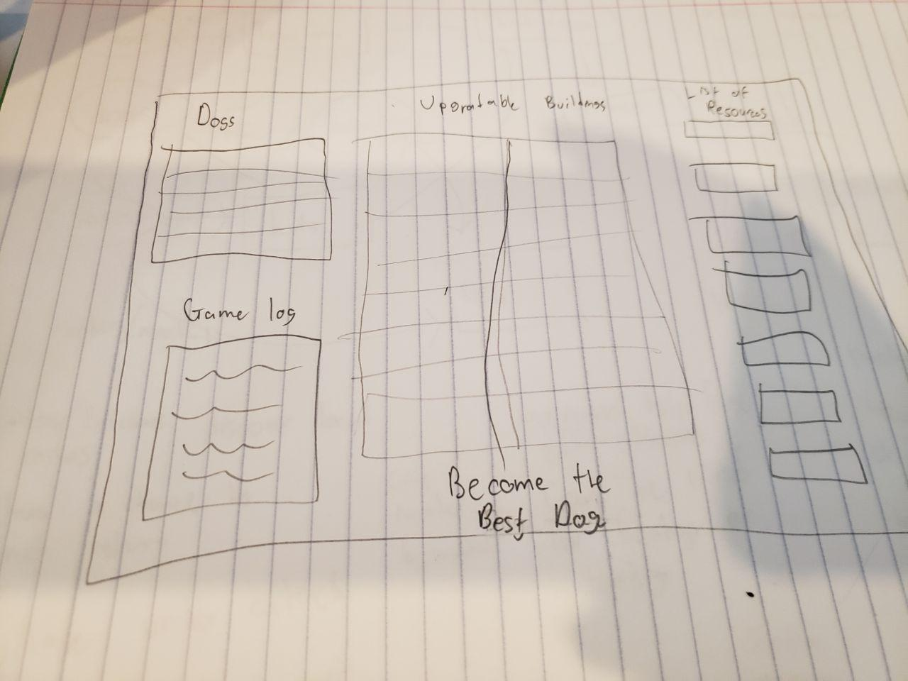

# A Simple Dog Game

## Game Demo
https://datkevin.github.io/A-Simple-Dog-Game/

## User Story: 
Game opens up in the browser as a mostly empty page. The only thing they see is the game title, a button that gets treats and at the bottom of the screen, the goal of the game which is to “become the best dog.” 

With the button being the only interactable object on the page, pressing it will gather a number of treats. With those treats, the player will get more dogs which will unlock sticks and more resources. As the player gains more resources, the page will dynamically add a list of and values of those resources. 

With more resources, the page will also dynamically add buttons and options to construct buildings which will improve or generate resources over time. They will either provide a number of resources on a certain timer or improve the number of resources obtained. The game will also maintain a list of what buildings have been created, how many they have, and what effect it has on overall production. 

The game will continuously grow as upgrades are unlocked and the dog civilization grows bigger and bigger. Once the user has unlocked a certain upgrade and have obtained the resources to complete the upgrade, the game is over and they are declared the winner. 

## WireFrames:

Rudimentary drawing of what the screen looks like when the game is opened for the first time

Rudimentary drawing of what the game will look like as the player progresses
