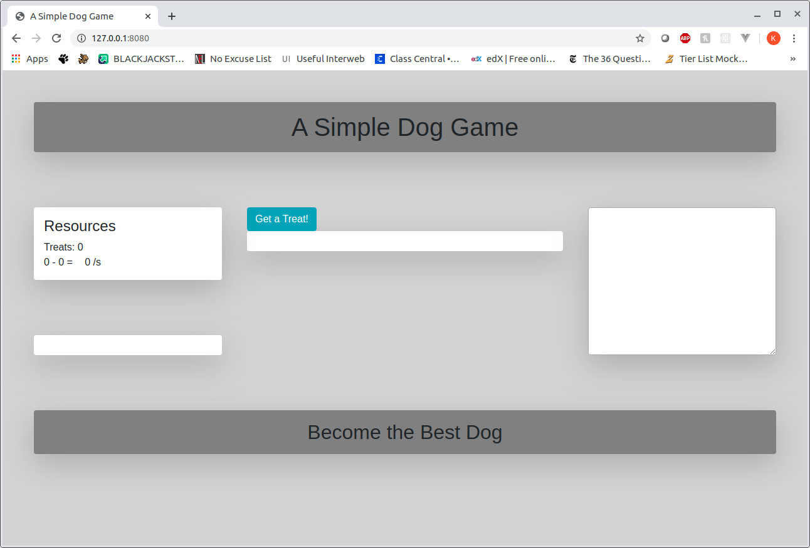

# A Simple Dog Game
 - Game Demo
 - Introduction
 - User Story
 - Wireframe
 - In Development

## Game Demo
https://datkevin.github.io/A-Simple-Dog-Game/

## Introduction
A Simple Dog Game is anything but. Taking inspiration from Kittens Game, A Simple Dog Game is an idle game in which the only thing you know is that your goal is to become the best dog. You start off simply with a button that can get you treats in which you use to get more dogs. Overtime, the player can start constructing buildings which will automatically produce resources for them. 

As they cross certain thresholds, events will start to occur and secrets will be unraveled. Choices will be made and the player will shape the world to their image in their ultimate quest to become the Best Dog. 
## User Story: 

Game opens up in the browser as a mostly empty page. The only thing they see is the game title, a button that gets treats and at the bottom of the screen, the goal of the game which is to “become the best dog.”

With the button being the only interactable object on the page, pressing it will gather a number of treats. With those treats, the player will get more dogs which will unlock sticks and more resources. As the player gains more resources, the page will dynamically add a list of and values of those resources.

With more resources, the page will also dynamically add buttons and options to construct buildings which will improve or generate resources over time. They will either provide a number of resources on a certain timer or improve the number of resources obtained. The game will also maintain a list of what buildings have been created, how many they have, and what effect it has on overall production.

The game will continuously grow as upgrades are unlocked and the dog civilization grows bigger and bigger. Once the user has unlocked a certain upgrade and have obtained the resources to complete the upgrade, the game is over and they are declared the winner.

## Wireframes:

Prototype of Home Page

Prototype of Entry Page

## Features in Development

 - New resources and buildings
 - Expanded Story
 - New Mechanics
 - Resource Caps
